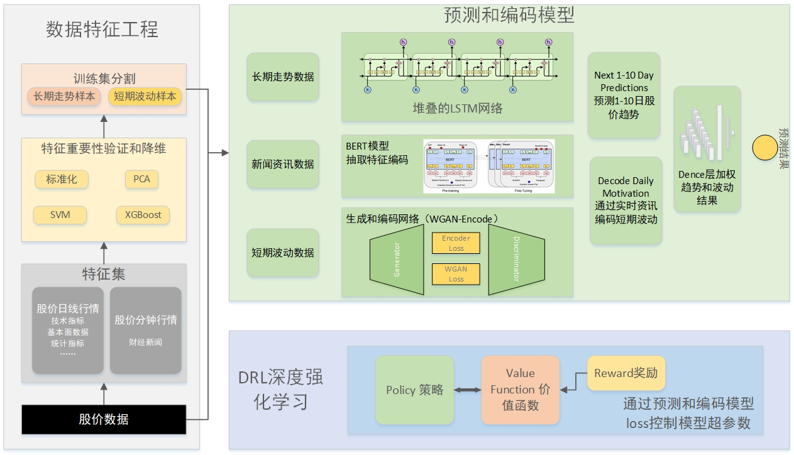

A Stock Prediction System with Deep Learning 
====
基于深度学习的股市预测系统
----

本系统参考了 https://github.com/borisbanushev/stockpredictionai 并尝试在A股市场中预测股价。

在股价预测基础上，实现依托强化学习算法的自动量化交易平台，平台的人工定义策略、回测系统、实盘交易等功能依托现有的开源平台修改构建，自动交易算法依托强化学习和预测学习结果，尝试将深度学习预测和智能Agent决策进行有效串联，实现稳定的决策收益。

数据来源：https://tushare.pro/

量化交易平台：https://github.com/vnpy/vnpy

For more information ： https://longfly04.github.io/A-Stock-Prediction-System-with-Deep-Learning/

-----

## 深度学习预测系统

本系统使用了时间序列模型对股票价格特征进行建模，并利用强化学习算法DQN控制模型训练过程，对超参数空间进行探索，期望找到针对每支股票最合理的模型。

作者同时正在探索一种新的基于强化学习的量化投资系统，以本系统预测结果为依据，结合策略库进行最优化选择，实现股价预测结合指标分析的量化投资系统。

系统框架图如下：

目录

[1. 概述](doc/1.概述.md)

[2. 研究现状](doc/2.研究现状.md)

[3. 系统框架和主要功能](doc/3.0系统框架和主要功能.md)

[3.1 数据获取](doc/3.1数据获取.md)

[3.2 特征工程](doc/3.2特征工程.md)

[3.3 模型](doc/3.3模型搭建.md)

[3.4 训练和控制](doc/3.4模型训练和调参.md)

[4. 创新点](doc/4.算法改进和创新点.md)

## 强化学习交易决策系统

基于强化学习的量化交易系统相比于传统量化交易具有很大优势，首先传统量化交易系统依靠回测来判断策略好坏，本身股市具有高度随机性，回测的历史结果不足以表示未来的股市走势，需要一种能够动态判断股市涨跌并作出科学决策的系统进行决策；其次，传统量化交易以市场和股票各种指标的特征进行人工设计算法，具有很大的主观经验性和决策面局限性，无法考虑大量的决策因子之间的关系，而通过强化学习算法对整个股市环境进行感知，并以历史数据作为自我训练环境进行不断的投资实验，可以实现对股市的精确判断，结合本系统重要的股价预测基础功能，可以在预测未来走势基础上合理投资并规避风险。

目录

[5. 强化学习概述](doc/5.强化学习概述.md)

[6. 量化交易系统框架](doc/6.量化交易系统框架.md)

[7. 策略库、股票池和实盘交易模块](doc/7.功能模块.md)

[8. 结果和评估](doc/8.结果和评估.md)

[9. 总结](doc/9.总结.md)

本系统基于成熟的量化交易框架扩展实现，始终站在巨人的肩膀上仰望星空。

-----

感谢支持，赚个积分。

https://tushare.pro/register?reg=266868 

<left></img></left>
