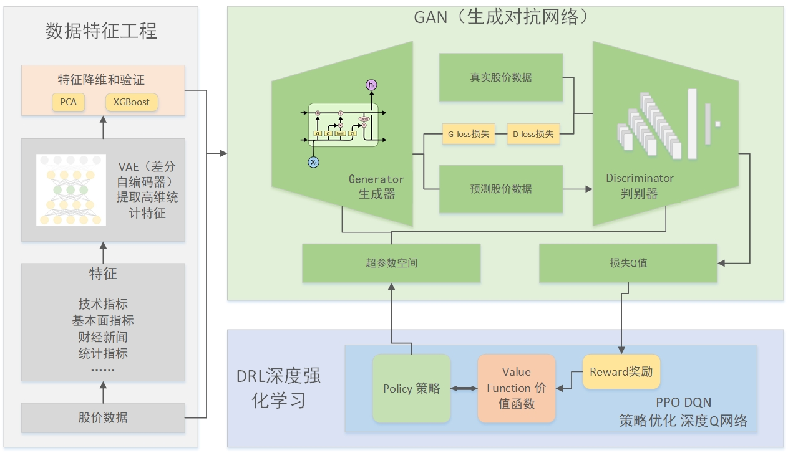

# 2. 系统框架

刚开始研究这个问题时画的框架图，也成功蒙住了几位导师。随着学习的深入并且经过一系列实验之后，发现这样的系统无法实现自己想要的功能，落入俗套了。

**于是，改革开放，更新框架图。**

>1.股价的行情信息按照时间跨度进行划分，时间跨度大的有月线、周线行情，时间跨度小的有1分钟、5分钟行情，不过，以上行情信息的基本数据元只是：开盘价、收盘价、最高价、最低价、成交量和成交额这6个基本信息，然后按照时间切片后得到离散的行情。

>2.行情信息体现的是市场自由交易的情况，卖家报价，买家出钱，多空博弈，瞬息万变，想要预测市场上投资者的投资意愿是一件几乎不可能的事情，我们只能根据客观的公开的数据来推测投资者会如何行动。所以除了行情信息之外，我们还需要上市公司的财务、经营情况，外部市场的信息，期货、基金等金融衍生物市场信息，现金流方面银行的存贷款利率，借贷利率等等，也就说，我们获取的信息越多元，得到的投资预测越有可能接近市场上投资者真正的投资意愿。

>3.基于以上考虑，首先我们要获得股票的行情，以日行情为主，同时我们要获得上市公司财务等基本面数据，外部市场、宏观经济等数据，作为日行情的特征，这样就得到了一个上百维度的股价数据集，通过时间序列模型我们就可以预测未来的股价走势情况。

>4.经过试验，以上想法思路是对的，但是有这么几个问题：一是预测得到的结果随着预测时间点的推移误差积累直到模型迅速塌陷，反映了股价模型的参数是随着时间变化的函数，我们无法用一个固定的深度神经网络来预测股价，股价预测模型必须随时间不断变化。二是在趋势上，虽然可以基本预测出股价走势，但是绝对值数据误差无法避免，必须通过其他方式修正误差。三是目前没有现成的估价时间预测模型可以直接拿来就用。

>5.所以，从自编码器中获得的灵感，我想通过文本序列分析加编码方式，解决股价预测问题。

>5.1 框架图内数据特征工程阶段，通过将日线数据和分钟线数据分别处理，得到两个数据集，其中这两个数据集的关系是，1个日线是240个分钟线数据的结果，也就是1天的股价波动体现在240分钟股价波动上。

>5.2 日线数据除了行情数据之外，还是有基本面数据、宏观经济数据、外部市场数据等，作为日股价的特征，训练堆叠LSTM网络，预测未来1-10日的股价走势。

>5.3 每日的分钟线数据是一个标准的数据集，包括240个时间点，每个时间点都是开盘、收盘、最高、最低、成交量、成交额信息，也就是240 * 6 = 1200维数据。将每日的分钟线数据编码，编码的标签就是1日的行情结果，可以用涨跌额，成交额等等代替。

>5.4 每日市场上都会有大量的财经新闻信息，包括非交易日、外部市场的信息都有可能对下一个交易日的行情起作用。说白了，财经信息直接传递到投资者，投资者根据财经信息判断市场走势，并作出自己的投资行动。我们想对每日的财经信息进行信息抽取和归纳，将财经信息这种文本数据映射到一个高维的，我们称之为“投资取向函数”的时变函数上，然后将这个时变函数与每日的分钟行情数据做关联，通过编码映射出一个文本信息——取向函数——股票行情的映射，这个映射的参数是时间t，文本p和相关系数λ，函数的结果就是预测的未来行情。如果我们能够成功学习到这个函数，那么预测股价只需要两步：一是通过长期趋势得到一个结果Z0，二是通过这个函数得到Z1，将这两个结果通过加权系数α，就可以得到最终的股价预测结果。

>6.预测长期走势，我们将使用LSTM网络，编码文本信息我们直接使用fine tuning的BERT模型，编码分钟线行情我们准备用WGAN，最后的股价加权直接用普通的全连接层。

>7.在这里面，还没有使用RL进行超参数调优，考虑到股价模型是时变模型，我们用Q函数模拟时变函数，进而进一步提高模型拟合股价的能力。

以上是我一开始进行的框架分析和构思。

随着系统不断趋于复杂，各种tricks也是花样繁多。以上的部分构思实现起来也是非常复杂，比如使用生成式对抗网络提取每日的股价波动的特征分布，完全没有好的思路，对于时序数据，直接照搬图像领域的算法是不一定行得通的。

本系统主要框架是：
1. 数据获取和整合模块
2. 数据特征工程、股价技术指标模块
3. 模型训练模块
4. 强化学习配置策略模块
5. 可视化模块
6. 集成服务接口API

