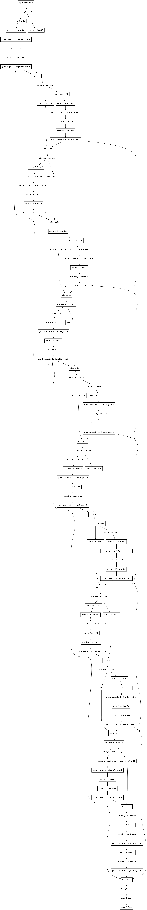

# 5. 训练模型

我始终反复思考建立股价预测模型的本源是什么：我们想预测一个公司股票的走势，根本目的在于根据交易者以及上市公司本身行为去判断这些行为对股价的影响，以便于提前预测股市未来波动并作出及时的投资策略。一般情况下，投资者会根据股价以及外界信息对投资行为进行执行，上市公司根据法律法规和自身经营情况，对外披露自己的财务、股东、以及盈利情况。这些都是会影响到股价波动的因素。

我们想通过一个模型，在长期对某一只股票的建模基础上，敏感应对以上提到的市场变化，并提前将股价波动预测出来。

我计划首先建立以日交易数据为基础训练集的股价中长期预测模型，这个模型依赖上市公司财务数据、宏观经历数据、以及市场参考数据等，建模更加宏观，忽略每日的波动情况。

在以上基础上，建立以每分钟或者每10分钟交易数据为基础的短期股价预测模型，这个模型更依赖市场随时的变化，以及外界的新闻、突发消息等。期待这个模型能够对当日出现的股价波动和走势进行预判和模拟。

## 模型训练思路

首先，我们需要一些基准模型对股价预测的结果进行评估，除了使用真实的测试数据之外，我们尝试使用几种比较常用的模型对股价进行预测。在特征工程阶段，我们使用了xgboost模型对参数的重要性进行了计算，并找出了25个与股价相关性很高的特征。在模型训练阶段，我们想通过n天的股价训练数据，预测出第n+1天的股价。如果模型的容量足够大，我们甚至可以从n天的股价中预测出n+3、n+7、n+21天的股价波动走势，这样就实现了我们这个项目的最终目的。

我们用监督模型对n+1天的股价进行预测。

1.支持向量机回归模型（SVC）

2.Xgboost集成树模型

3.LSTM网络模型

以上三种模型都是有监督的模型。

其次，我们再尝试使用生成模型对股价进行预测。

1.VAE变分自编码器

2.GAN生成对抗网络

以上两种生成模型本质上都是从高斯分布中采样，并通过模型生成数据样本。如果用贝叶斯理论可以证明其本质上都是一致的，模型都在尝试对真实分布和生成分布的KL散度进行优化和学习。

最后我们想通过DRL对生成模型的参数进行学习，不断尝试优化模型。

### 使用调优后的Bert编码每日股价走势

股价走势作为一种时间序列信息，如果我们以1分钟作为周期进行采样的话，那么每日的走势就是一个特征维度为开盘、收盘、最高、最低、成交量5个维度，时间上是240分钟的一个固定的特征集合。交易者进行交易的依据，一部分来自于股价涨或者跌的走势，一部分来自于各个方面的市场消息，所以，我尝试利用Bert模型对财经信息进行训练调优，结合股价1日的交易数据，使用自编码器编码每天的股价走势，用低维度的编码近似反映1个交易日内股价走势，结合生成模型GAN，生成有编码影响的股价走势。

我们想直接使用成熟的bert编码框架，可以将任意长度的中文序列编码为固定长度的编码。这样我们就可以不用考虑Bert模型的实现细节，专注于对于编码之后的向量进行学习和处理。我们直接使用了Bert as service。

感谢：https://github.com/hanxiao/bert-as-service

编码之后的向量进行了归一化，但是我们仍然可以通过可视化的方式看出不同标签下编码的分布，由于编码时768维，我们随机选取2个维度进行可视化。

财经新闻的信息主要有10个标签，分别是：
names = ['宏观','行业','公司','数据','市场','观点','央行','其他','焦点','A股']。

随机选取2个维度：

对比多个维度：

我们可以看出，仅仅通过2个维度很难区别不同标签的编码有明显不同，但是同一个标签下的新闻还是有一定的聚类特征，通过这个我们可以推测出，编码在高维空间中有可能会表现更好的区分特性。

还有一个问题需要注意：因为财经新闻发生的时间是随机的，在一个指定的时间段内，我们无法预知新闻编码出现的时间点，这样会对模型数据的特征工程带来一些问题，所以我准备在处理财经新闻数据时，将没有新闻发生的时间点人工填充数据，使用的是高斯噪声数据。通过以上的编码可视化我们可以看出，bert编码的整个分布其实也倾向于高斯噪声，我们使用人工数据不会对模型的学习带来太多负面影响。

### 直接使用原版VAE对股价模型进行编码

利用Keras自带的vae模型，尝试对股价特征进行编码时，出现无法训练，训练loss为负数，验证集loss直接发散的情况。我尝试修改了隐层的参数，用更大维度的隐层编码，发现结果并没有变化。

首先是用训练集/验证集为0.9的情况下对模型进行训练的结果：

训练结果很糟糕，模型没有被训练出来，但是encode的前两个维度貌似有聚集的特征。

然后用训练集/验证集为0.98的情况下对模型进行训练：

验证loss出现很大的波动，而且训练误差为负数，编码反而更加随机。

综合考虑可能有如下原因：

1.股价数据是时间序列数据：原版的变分模型没有对时间序列信息进行编码的能力，仅仅是对图像编码的移植。

2.股价的特征选择问题：一个上市公司的股价波动与其财务、市场信息的关联性较小，特征无法代表股价的走势。

3.模型还没有发现股价走势的深层信息，或者是无法拟合股价的波动特性。

原版的VAE模型是用来处理图像的，主要是用来生成nmist数据集中的手写数字，在直接用于时间序列数据中时，出现很多问题。我想，我们需要修改原本的模型结构，使其能够处理时序数据。

TODO
## 使用seq2seq模型预测财经新闻对股价波动的影响

seq2seq模型是一个比较经典的序列编解码模型，主要用在机器翻译、标题生成、主题归纳等场景，在NLP环境下，语言模型都是离散的向量组成，seq2seq模型捕捉离散向量之间的时序关系并进行编解码，实现对文本的生成。

从另一个角度来看，encoder-decoder模型是有信息瓶颈的，也就是编码的维度，所以本身这个模型无法传递大量的文本信息，在长序列编码场景下，受限于编码的维度所携带的信息受香农定律所限，有可能出现模型的极限。

股价波动本身是市场投资者投资意愿动力学的反应，股价本身具有高度的无自相关性，因果性很难把握和预测，但是大量投资者行为是有统计学规律的，而且主力操作和散户操作所适用的动力学模型是不同的。

我们假设，短期的股市波动主要动因是投资者的投资意愿，投资意愿又来自于市场的风吹草动，财经新闻是一个很好的反应市场投资动向的因素，因为财经新闻涉及面很广，包含有大量有价值的投资信息，投资者可能会根据消息跟风进行投资。

以下是财经新闻部分截取：

>10:28新能源汽车股直线拉升，中通客车封涨停，亚星客车大涨7％，北汽蓝谷、泉峰汽车、华菱星马等多只个股走强。

>10:23【工信部：将支持有条件的地方建立燃油汽车禁行区试点】工信部答复制定禁售燃油车时间表建议：将支持有条件的地方建立燃油汽车禁行区试点。

>10:18【武汉集聚芯片企业突破百家】8月21日，湖北省庆祝新中国成立70周年系列新闻发布会第五场，主题为“武汉——产业之‘芯’、区域之‘心’、动能之‘新’”。会上披露，武汉已集聚芯片企业100余家，一个以芯片设计为引领、芯片制造为核心、封装测试与材料为配套的集成电路产业链正在形成。（湖北日报）

>10:03【片仔癀中药饮片因“一般缺陷5项”被福建省药监局勒令整改日前，福建省食药监局公布的“2019年中药饮片质量集中整治(生产环节)专项检查及处理情况公示“显示，，漳州片仔癀药业股份有限公司、福建铭远制药有限公司等企业因生产的中药饮片存在缺陷而被勒令整改。

>10:03OLED板块异动，领益智造大涨6%，长信科技涨5%，京东方A、香山股份、深天马A、晶瑞股份、国风塑业集体走强。

>10:02啤酒板块拉升，珠江啤酒直线封板，燕京啤酒、兰州黄河、青岛啤酒、惠泉啤酒等纷纷走强。

>09:57【基本医疗卫生与健康促进法草案：医疗卫生机构不得对外出租、承包医疗科室】 基本医疗卫生与健康促进法草案明确举办医疗机构应当具备的条件，规定医疗卫生机构不得对外出租、承包医疗科室，非营利性医疗卫生机构不得向出资人分配收益，禁止伪造、变造、买卖、出租、出借医疗机构执业许可证。同时，草案加大对上述违法行为的处罚。（央广）

我们可以看到，财经新闻包含各个投资板块的消息，而且还有对股市波动的描述，虽然是总结性、报道性的新闻，但给投资者以积极或者消极的信号，也是能够反映一部分投资者投资意向的。

我们想通过财经新闻，反映出股市波动，看新闻中有没有可以影响股市波动的因素。

我们将使用seq2seq模型对股价进行建模。首先我们要对财经新闻进行处理，我们使用了bert预训练模型对变长的新闻文本序列编码成一个768维向量，因为新闻发生具有不确定性，所以我们使用一些噪声数据填充新闻序列，之前的可视化结果可以发现bert编码出来之后的结果在空间中具有高斯噪声的特性，所以我们也使用近似的噪声数据填充。

然后我们要划分不同时段的编码样本，由于每天的开盘时间一共只有4个小时，这4个小时内的新闻流是很有参考价值的，我们假设它与实时的股价波动有关联关系，休盘的20个小时，从财经新闻的角度看，也包含一些有价值的信息，但是这时候没有直接的交易，我们假设休盘期的新闻会影响投资者心理，并且最终影响在下一个开盘日的开盘价上，也就是一个昨收盘和今开盘的差别。如果这样的话，我们的模型需要处理两种不同的样本：

1.休盘期新闻编码序列样本和昨收今开的差；

2.开盘期新闻编码序列和股价波动序列。

这样的编解码器需要进行微调，我们以seq2seq编解码器为核心，在解码器段增加额外的网络层以将序列输出转化为标量，并反映在标签信息上。训练时，我们需要划分样本进行训练，对于休盘期新闻，通过间隔等参数，用生成器生成序列和标签，训练m个batch后，再使用
开盘期新闻训练序列标签，这两个训练过程是共享整个编码器和解码器的权重的，这样可使模型尽可能的发现新闻中影响投资者行文的消息。

## 使用时间序列卷积模型进行股价预测

时序卷积（Temporal Convolutional Networks）模型在许多领域上被证明是可以取代RNN网络的深度模型，相比于传统的RNN模型，时序卷积因其强大的可扩展性、长时依赖性以及可并行能力，使得在大量的任务中表现出比RNN更加优异的性能。

先上图。

如上图可以看到，本系统中使用的网络是一个深度网络，其中大量的卷积层和残差连接构成了这个深度网络的基础。

## 使用GAN网络生成股价预测数据

使用了大概一周的时间系统学习了GAN这个庞大的生成模型体系，这里还是要非常感谢苏神的博客提供的通俗易懂且鞭辟入里的解释。

https://kexue.fm/content.html

GAN中的对抗和生成两个模型，看上去只需要将各自的结果进行比较，然后分别根据比较结果优化自己模型，最后实现生成结果与真实结果逐步逼近即可。但实际上，这个过程中包含了非常丰富的数学推导，极其广泛的数理基础以及可以推广到很多方面的应用前景。

目前GAN网络在图像编码和生成方面取得了卓有成效的进展，我们可以看到人脸图片的生成过程，包括从一个男性脸逐渐变成婴儿脸的逐步渐进的变化情况。我们将其理解为，模型学习到了人脸数据集中不同人脸的特征，并将这些特征编码，再将这个编码空间映射到一个高斯分布空间中，确保整个编码空间可以被采样到，这样话，我们就能够通过人工设定采样参数的方式获取到这个编码，从而生成我们想要的人脸图像。这个思路是将人脸特征信息从隐参数空间中挖掘出来，成为一个能被大家所利用的特征，我们就可以使用这个特征空间，来做很多有趣的事情。

>作为股价生成任务中的模型，我始终在思考如何将图像处理任务迁移到时间序列模型的生成任务上来，在前人所做的研究中，SeqGAN完成了文本信息的GAN网络，通过LSTM模型作为生成器，**CNN网络作为判别器**，使用Policy Gradient强化学习算法的loss作为优化对象进行seq to seq的生成任务，取得了一定的成果。但是文本信息生成任务与股价信息生成任务还是有一些区别。主要是问答系统或者翻译系统的seq to seq模型基于的是编码，以编码为传递信息的主要媒介，再看seqGAN模型，也是将这个编码映射到高斯空间，中间也加入了一些便于模型收敛的技巧。而股价模型更多的是通过历史交易数据预测未来，历史数据与未来数据有一定的时间连续性，而且股价特征既有消息面、技术面也有基本面，如何捕捉这些特征并预测未来股价，与传统的文本序列生成模型有很大不同。这也是我始终在纠结和思考的问题。

以上是我在刚刚学习GAN网络的思想的时候提出来的想法，也是照搬了大神的模型思路，但是我注意到一点，目前绝大部分的GAN模型，其生成器和判别器都是相当规模的同样类型的模型，比如目前应用了W散度做L约束的WGAN-div，原文：https://kexue.fm/archives/6139。

它主要使用了两个规模相同但是内部结构相反的CNN网络作为生成器和判别器，再加上使用使用了W散度作为惩罚项，性能上优于基于梯度惩罚的WGAN，在图像生成任务上表现较好。

那么在序列生成任务上，是否也应该在生成器和判别器的规模上进行权衡，尽量做到二者一致。

另外，序列判别器可以视为一个文本分类任务，而序列生成器可以视为一个seq2seq的Decoder，这样的话，二者都使用单层的LSTM网络更容易被我们传统思维接受。

废话不多说，干。

